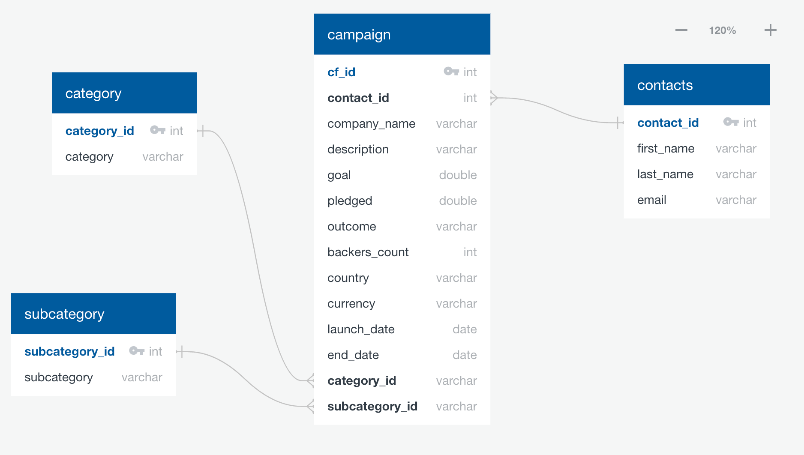
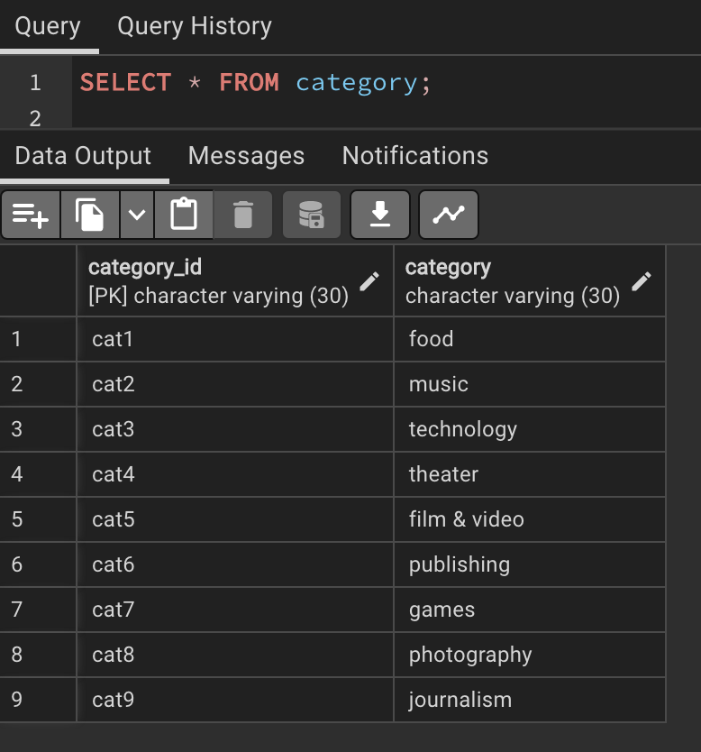
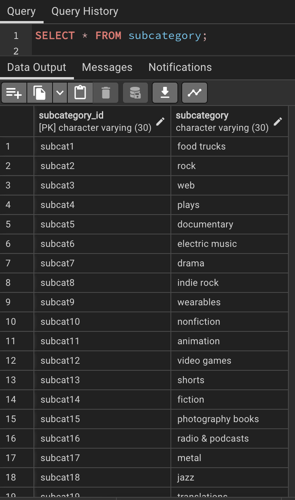
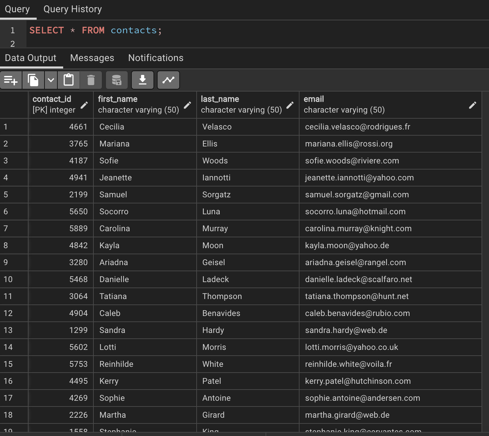
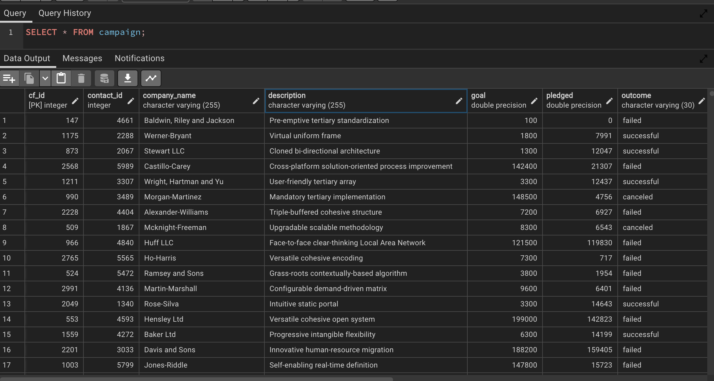

# Crowdfunding_ETL

-SUMMARY-

This Project asked for 4 DataFrames to be created, exported to csv files, and then uploaded to a database, with a focus on ETL methods. Extract (Pulled data from .xlsx files and converted to Pandas DataFrames), Transform (Cleaned data in DataFrames, updated datatypes and converted data where required), and Load (Export DataFrames as .csv files and load directly into a Postgres SQL Database)

-REQUIRED DEPENDANCIES-

Pandas, Numpy and Openpyxl (pip install openpyxl)

-WORKING NOTES-

The .ipynb file contains relevant comments and can be run sequentially to import the required .xlsx files and convert them to DataFrames. Each DataFrame is then converted to a .csv file and saved in the /Resources folder. 

An ERD is then provided mapping out how the Database should be created using the four .csv files generated from the .ipynb file. (Found in Screenshots folder)

The .sql file contains all SQL required to create the database, and relevant tables. When running the code, highlight the first black (CREATE DATABASE) and run it seperate to the remaining SQL to ensure the Database is created correctly.

The order the tables are created in are also the order in which the data must be imported. Four tables are then created. As per the requirements I then imported the four provided .csv files into the relevant tables (Category,Subcategory,Contacts,Campaign). 

Category

Subcategory

Contacts

Campaign

Screenshots of these populate tables are found in the 'Screenshots' folder in the repository

-OTHER COMMENTS-

-Attempted to push more regularly to ensure constant trail of commit history in repository.

-Files created with names provided in Starter Code file
